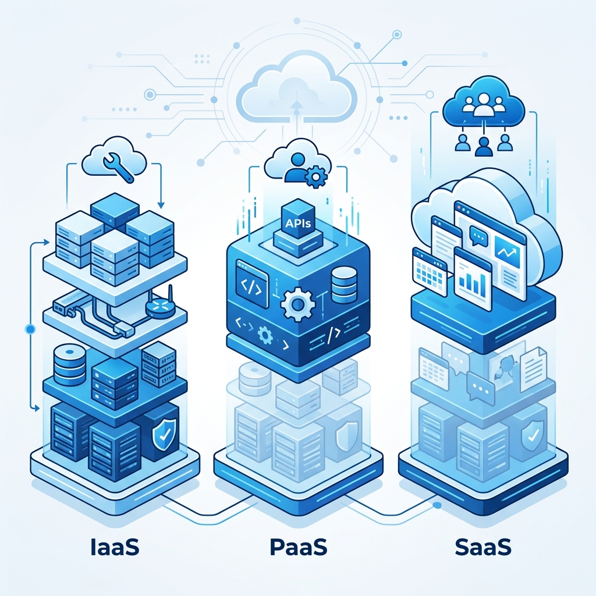

# ☁️ Guia de Estudos: Microsoft Azure Fundamentals (AZ-900)

## 📌 Sobre este Projeto

Este repositório foi criado para o desafio de projeto da **DIO (Digital Innovation One)**, focado em demonstrar o uso do **Google NotebookLM** como uma ferramenta de **aprendizagem ativa**. Aqui, organizei meus estudos para o exame **AZ-900**, utilizando IA para analisar fontes oficiais e extrair conhecimentos estruturados.

### 📝 Detalhes do Projeto
- **Estudante:** Ricardo Santos
- **Nickname:** [RicardoSantos-TI](https://github.com/RicardoSantos-TI)
- **Ferramenta IA:** [Google NotebookLM](https://notebooklm.google.com/)
- **Tema:** Microsoft Azure Fundamentals (AZ-900)

---

## 🎯 Contexto e Objetivos

O objetivo principal deste caderno temático é consolidar os fundamentos da nuvem Microsoft Azure, permitindo uma compreensão clara de como a infraestrutura global da Microsoft pode ser utilizada para resolver problemas de negócio.

**Principais Metas de Estudo:**
1.  **Fundamentos de Nuvem:** Entender os benefícios (Agilidade, Disponibilidade, Escalabilidade) e modelos (IaaS, PaaS, SaaS).
2.  **Arquitetura Azure:** Explorar Regiões, Zonas de Disponibilidade e Grupos de Recursos.
3.  **Segurança e Governança:** Diferenciar Azure Policy, RBAC e entender o Modelo de Responsabilidade Compartilhada.
4.  **Gerenciamento de Custos:** Identificar fatores que influenciam a precificação no Azure.

---

## 📚 Curadoria de Fontes

Para alimentar o NotebookLM com informações precisas e atualizadas, selecionei as seguintes fontes oficiais:

1.  **[Trilha: Conceitos de Nuvem](https://learn.microsoft.com/pt-br/training/paths/microsoft-azure-fundamentals-cloud-concepts/)** - Foco em benefícios e modelos de serviço.
2.  **[Trilha: Arquitetura e Serviços](https://learn.microsoft.com/pt-br/training/paths/azure-fundamentals-architecture-services/)** - Detalhes sobre a infraestrutura global.
3.  **[Trilha: Gerenciamento e Governança](https://learn.microsoft.com/pt-br/training/paths/azure-fundamentals-management-governance/)** - Segurança, custo e conformidade.
4.  **[Guia de Exame AZ-900 (PDF)](https://query.prod.cms.rt.microsoft.com/cms/api/am/binary/RE3Vw9I)** - Checklist oficial de habilidades medidas.

---

## 🧠 Engenharia de Prompts e "Cicatrizes"

O uso estratégico do NotebookLM requer prompts precisos para evitar alucinações e obter respostas contextualizadas.

### 🚀 Prompts Estratégicos (Testados)

| Objetivo | Prompt | Resultado Esperado / Insight |
| :--- | :--- | :--- |
| **Exploração** | "Com base nas fontes, explique o Modelo de Responsabilidade Compartilhada. Quem é responsável pela segurança do SO em uma VM Azure?" | A IA deve identificar que o cliente é responsável pelo SO no modelo IaaS. |
| **Comparação** | "Crie uma tabela comparando Escalabilidade Vertical (Scale Up) e Horizontal (Scale Out). Qual serviço Azure automatiza esse processo?" | Identificação do 'Virtual Machine Scale Sets'. |
| **Cenário Real** | "Uma empresa quer migrar um app legado sem mudar o código, mas quer se livrar da manutenção de hardware. Qual modelo de nuvem é o mais indicado?" | A resposta deve apontar para Nuvem Pública com modelo IaaS. |

### 🛠️ Cicatrizes e Troubleshooting (Cicatrizes)

> [!CAUTION]
> **Desafio Real (Importação de Fontes):** Durante a criação do caderno, notei que o NotebookLM apresentou erro **404** e falha de acesso ao tentar importar links diretos do Microsoft Learn. Isso ocorre devido às proteções de scraping do portal da Microsoft.
>
> **Solução Aplicada:** Em vez de usar os links diretos, acessei cada trilha, utilizei a função "Imprimir como PDF" do navegador e fiz o upload manual dos arquivos para o NotebookLM. Isso garantiu que 100% do conteúdo fosse indexado corretamente.

> [!IMPORTANT]
> **Ajuste de Prompt:** A IA inicialmente deu respostas muito genéricas sobre "Segurança no Azure".
> **Solução:** Adicionei a restrição: *"Responda utilizando EXCLUSIVAMENTE os PDFs e links fornecidos. Foque na diferença técnica entre Azure Policy e RBAC."*
> **Resultado:** A IA parou de dar dicas gerais de internet e focou nos conceitos de 'Conformidade de Recurso' (Policy) vs 'Acesso de Usuário' (RBAC).

---

## 📖 Miniguia de Estudo (Consolidado)

### 1. Resumo Estruturado

*   **CapEx vs OpEx:** A beleza da nuvem está na mudança de grandes gastos iniciais (Capital Expenditure) para custos baseados em consumo (Operational Expenditure).
*   **Infraestrutura:** O Azure é dividido em **Regiões** (locais geográficos) e **Zonas de Disponibilidade** (data centers independentes dentro de uma região para alta disponibilidade).

### 2. Glossário "Nota 10"

*   **VNet (Virtual Network):** Sua rede lógica isolada no Azure.
*   **Blob Storage:** Serviço para armazenar grandes quantidades de dados não estruturados.
*   **Azure Resource Manager (ARM):** O serviço de implantação e gerenciamento que fornece uma camada consistente para criar recursos.
*   **NSG (Network Security Group):** Filtra o tráfego de rede para e de recursos Azure em uma VNet.
*   **Azure Bastion:** Permite conexão RDP/SSH segura sem expor IPs públicos.
*   **Azure Advisor:** Mentor pessoal na nuvem que fornece recomendações de custo, segurança e performance.

### 3. Checklist de Revisão (Prompts Reutilizáveis)

Utilize estes prompts no NotebookLM para revisões rápidas:
- *"Gere um quiz de 5 perguntas de múltipla escolha sobre Identidade e Segurança do Azure."*
- *"Quais são os 4 principais fatores que afetam os custos no Azure?"*
- *"Resuma as principais diferenças entre MS Entra ID (antigo Azure AD) e o Active Directory tradicional."*

---

## 🛠️ Como reproduzir este caderno

1.  Acesse o [NotebookLM](https://notebooklm.google.com/).
2.  Crie um novo caderno chamado **"AZ-900 Ricardo Santos"**.
3.  Faça o upload dos links da Microsoft Learn listados na seção de **Curadoria**.
4.  Utilize os **Prompts Estratégicos** documentados aqui para iniciar suas interações!

---

> [!TIP]
> **Dica para o Portfólio:** Mantenha seu README atualizado com novos insights à medida que avança na certificação!

---
Desenvolvido com carinho por **Ricardo Santos** 🚀
